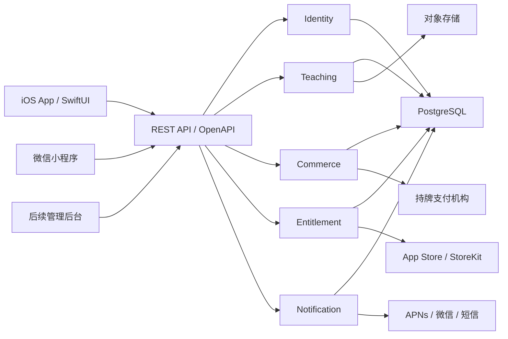

# ClassTrace 目标系统架构

## 1. 范围

第一版以原微信小程序当前可用能力为验收基线，支持教师和家长两类角色。架构按多端产品设计：iOS 与微信小程序最终共享同一套账号、API、数据和业务规则。

## 2. 非功能目标

- API 服务可用性：首个全量版本目标 99.9%。
- 普通查询服务端 p95 小于 300ms，不含公网传输。
- 首页有缓存时 1 秒内展示可用内容，无缓存时提供骨架屏。
- 所有资金、课时与上课确认写操作支持幂等。
- 核心资金与课时操作使用数据库事务。
- 生产环境日志不得记录密码、验证码、令牌、完整手机号或支付凭证。
- RPO 目标 1 小时，RTO 目标 4 小时。

## 3. 总体架构



## 4. 后端形态

采用模块化单体，不采用微服务。模块共享一个部署单元和 PostgreSQL，但只能通过公开应用服务或领域事件协作。

```text
Identity
Student
Course
Classroom
Schedule
Attendance
HourLedger
Learning
Commerce
Entitlement
Notification
Feedback
```

同步业务使用数据库事务；通知、统计刷新、支付回调后续处理使用事务内 outbox 事件。首个全量版本不引入 Kafka，后台任务使用数据库 outbox worker，并保留后续替换消息中间件的边界。

## 5. iOS 架构

iOS 使用 feature-first 目录与单向依赖：

```text
SwiftUI View -> ViewModel -> Use Case -> Repository Protocol
                                          |
                                  Remote / Local Adapter
```

View 不直接访问网络。ViewModel 不实现扣课时、退款等领域规则。DTO 不进入 View；网络层转换为领域模型后再交给功能模块。

本地存储边界：

- Keychain：access token、refresh token。
- SwiftData/SQLite：可丢弃的离线缓存和同步游标。
- UserDefaults：主题、筛选、引导完成状态等非敏感偏好。
- 服务端 PostgreSQL：业务事实的唯一来源。

## 6. 身份模型

`users.id` 是唯一业务身份。Apple、手机号和微信只是登录凭证：

```text
users
user_identities(provider, provider_subject, user_id)
user_roles(user_id, role)
students
student_guardians(student_id, guardian_user_id)
```

用户可同时拥有教师与家长角色。业务表不保存 openid、手机号或 Apple identifier。

## 7. 教学与账本

三个账本严格分离：

1. `hour_ledger`：课时充值、消费、调整、撤销，追加写入，不物理删除。
2. `course_orders/payment_transactions`：家长购买课程套餐的订单与支付事实。
3. `subscriptions/entitlements`：ClassTrace VIP 与功能权限。

确认上课在一个数据库事务中完成：锁定课节、验证状态、写考勤、追加课时流水、更新余额快照、写 outbox。请求必须携带 `Idempotency-Key`。

教学套餐默认 `direct_full`：支付机构收款后全额结算给教师，ClassTrace 维护剩余课时和退款计算，不持有用户余额。

## 8. 通知

业务模块只产生通知事件，不直接调用 APNs：

```text
domain event -> notification event -> user preference -> delivery
```

通道包括站内信、APNs、微信订阅消息与可选短信。每次投递包含去重键、模板版本、资源路由和投递状态。iOS 深链使用稳定资源路径，例如 `classtrace://sessions/{id}`。

## 9. API 约定

成功：

```json
{"data":{"id":"cls_123"},"requestId":"req_123"}
```

失败：

```json
{"error":{"code":"INSUFFICIENT_CLASS_HOURS","message":"剩余课时不足","details":{}},"requestId":"req_123"}
```

使用 HTTP 状态码表达结果；错误码稳定、可本地化。旧云函数 `{code,message,data}` 只存在于迁移适配层，不暴露给新客户端。

## 10. 主要失败模式

| 失败 | 处理 |
|---|---|
| 重复确认上课 | 幂等键 + 唯一约束 |
| 事务中部分写入失败 | PostgreSQL 原子回滚 |
| APNs 不可用 | outbox 重试，站内信仍可见 |
| 支付回调重复或乱序 | 验签、事件 ID 去重、状态机校验 |
| 本地缓存过期 | stale-while-revalidate，用户主动刷新 |
| Token 过期 | 单飞刷新；失败后清理 Keychain 并回登录页 |
